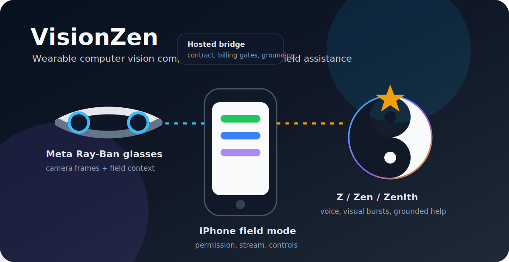
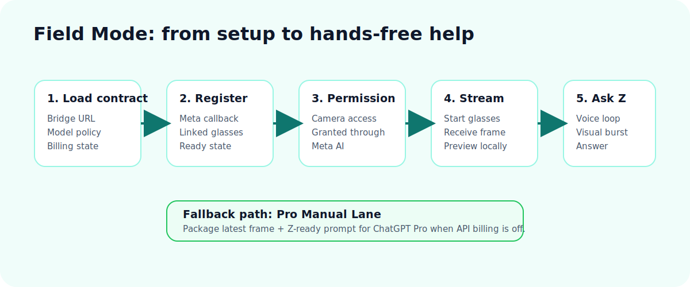
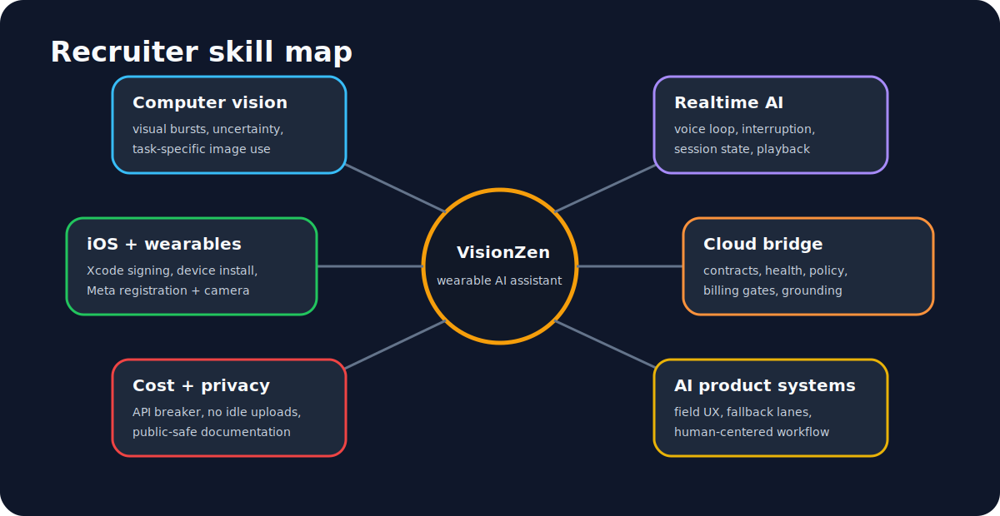

# Zenith Computer Vision Case Study

> Wearable computer-vision companion architecture: Meta Ray-Ban glasses, iPhone field mode, live voice interaction, bounded visual bursts, and source-grounded troubleshooting.

This repository is a **public case study** for the private VisionZen implementation. It explains the product strategy, technical architecture, implementation milestones, cost controls, and recruiter-relevant skill domains without exposing proprietary source code, credentials, personal data, glasses captures, or private SDK details.

**AI + grounding:**

**Mobile + wearables:**

**Platform:**

---

## TL;DR for recruiters

| | |
|---|---|
| **What it is** | A wearable AI assistant prototype that lets a user speak with "Z" through Meta Ray-Ban glasses and an iPhone bridge, with visual context from the glasses camera. |
| **Why it matters** | It explores hands-free AI assistance for real-world tasks: diagnosing what is in front of you, walking through repairs, reviewing homework, translating visible text, and explaining next steps while your hands are busy. |
| **Status** | Working private prototype: glasses registration, permission flow, live frame stream, Realtime voice loop, field-mode UX, and bounded Perplexity grounding are documented. |
| **My role** | Solo product owner and technical lead: architecture, iOS client, bridge service, cost guardrails, field UX, testing workflow, and documentation. |
| **What this repo shows** | Product strategy, implementation plan, architecture diagrams, risk controls, milestone history, and skills demonstrated. |
| **What this repo omits** | Source code, credentials, private SDK implementation details, personal frames, proprietary prompts, and anything that would compromise security or privacy. |

---

## The product in one picture

VisionZen is designed around a simple field loop:

1. The user wears Meta Ray-Ban glasses and keeps the iPhone app open.
2. The glasses provide camera frames through the iPhone wearable session.
3. The app only sends visual context when the user explicitly asks.
4. A hosted bridge applies cost gates and routes approved requests.
5. Realtime voice handles the conversation, while Perplexity supplies grounding for domain-specific questions.

---

## Case-study structure

- [TECHNICAL.md](TECHNICAL.md) — public architecture overview and boundary decisions
- [docs/01-product-brief.md](docs/01-product-brief.md) — product framing and user scenarios
- [docs/02-wearable-architecture.md](docs/02-wearable-architecture.md) — glasses, iPhone, bridge, and AI loop
- [docs/03-cost-privacy-guardrails.md](docs/03-cost-privacy-guardrails.md) — billing breaker, idle-first vision, and data minimization
- [docs/04-implementation-milestones.md](docs/04-implementation-milestones.md) — build timeline and proof points
- [docs/05-recruiter-readout.md](docs/05-recruiter-readout.md) — skills and interview talking points

Skill-domain deep dives:

- [Computer Vision](docs/skills/computer-vision.md)
- [Realtime AI Systems](docs/skills/realtime-ai-systems.md)
- [iOS + Wearables](docs/skills/ios-wearables.md)
- [AI Product Systems](docs/skills/ai-product-systems.md)

---

## Planning and technical implementation highlights

### 1. Browser proof first

The first milestone was not the glasses. It was a browser harness that proved the core loop: microphone permissions, Realtime voice, camera preview, explicit frame send, and bounded visual streaming.

Why this mattered: it created a low-friction regression bed before the iPhone and glasses layers introduced device-signing, certificate, Bluetooth, wearable registration, and callback complexity.

### 2. iPhone field mode

The iOS app moved from debug controls to a field-oriented workflow:

- load bridge contract
- confirm API billing posture
- register glasses
- grant camera permission through Meta AI
- start glasses stream
- start/stop Z
- package latest frame for a no-API manual ChatGPT Pro lane

### 3. Cost controls as product features

The prototype revealed a real failure mode: continuous visual streaming into a Realtime conversation can become expensive quickly. VisionZen treats cost controls as first-class product behavior:

- API billing is locked off by default.
- Realtime minting is blocked unless explicitly enabled for a test.
- Idle mode sends no frames.
- Vision uploads are bounded bursts, not continuous background streaming.
- A manual Pro lane supports no-API handoff.

### 4. Grounding for real-world tasks

Computer vision alone is not enough for field assistance. If the user asks about a plumbing fixture, homework worksheet, repair step, or translation, the assistant needs domain grounding and uncertainty discipline.

VisionZen uses a split:

- Realtime sees the actual image frame.
- Perplexity provides current, source-backed grounding for the task domain.
- Z is instructed to answer cautiously and avoid overclaiming when the image is unclear.

### 5. Public case-study boundary

The private build repo contains the implementation. This public repo is intentionally documentation-only. The goal is to show judgment: product thinking, architecture, tradeoffs, cost discipline, privacy posture, and a credible path from prototype to field-ready assistant.

---

## Headline artifacts

| Artifact | Recruiter signal |
|---|---|
| Browser harness proof | Reduced risk before native-device complexity |
| iPhone native app | Shipped real device workflow through Xcode signing and install |
| Meta wearable registration | Navigated third-party wearable SDK integration and permission flow |
| Glasses frame stream | Confirmed live visual frames from Ray-Ban camera into the app |
| Realtime voice loop | Built two-way voice interaction with assistant playback and interruption |
| Cost breaker | Responded to real billing risk with bridge-level controls |
| Manual Pro lane | Designed a zero-API-spend fallback path |
| Perplexity grounding | Added source-backed support for troubleshooting and how-to scenarios |

---

## Visual skill map

---

## Author

**Stephen D. Gardner**  
Founder-builder, AI product systems, iOS/wearables experimentation, cloud architecture, and applied AI workflows.

Related public case study: [Explanova AI Product Case Study](https://github.com/stephengardnerd/explanova-ai-product-case-study)

