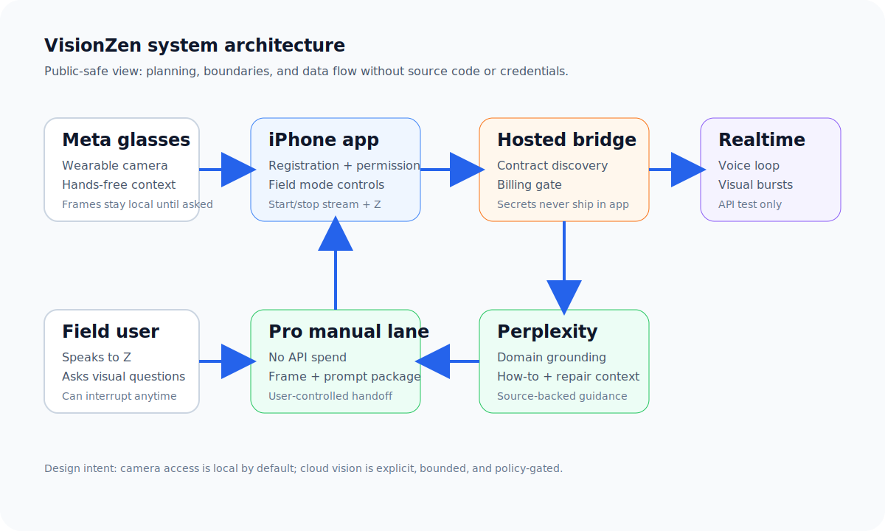

# Wearable Architecture

← [Back to README](../README.md)

---

## Architecture visual

---

## Core loop

The core loop is deliberately small:

1. Register VisionZen as a wearable integration.
2. Grant camera permission through the Meta AI permission flow.
3. Detect the linked glasses.
4. Start the wearable session.
5. Receive frames locally.
6. Send a bounded frame burst only when the user asks Z for visual help.

---

## Why an iPhone bridge app

The iPhone is the practical integration point because it can coordinate:

- Meta AI app registration callbacks
- wearable permission flows
- native audio session behavior
- local field controls
- bridge contract loading
- no-API manual handoff

The glasses are the sensor. The phone is the control surface.

---

## Hosted bridge responsibilities

The hosted bridge keeps sensitive policy out of the mobile UI:

- advertises the current contract and model posture
- blocks Realtime secret minting unless API mode is explicitly enabled
- exposes health state for billing and grounding
- routes grounding requests
- keeps server-side keys out of the app bundle

---

## Debugging lessons

The hardest part of the build was not "send an image to an AI model." The hard parts were:

- callback URL alignment
- developer-mode and release-channel setup
- camera permission state
- session state transitions
- Realtime socket readiness
- audio routing and playback
- keeping the UI explainable while debugging with a phone in hand

That is the difference between a demo and a field-capable prototype.

