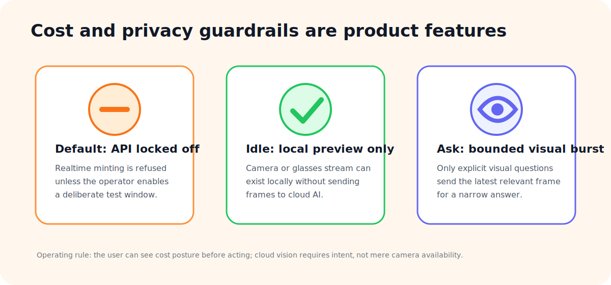

# Cost and Privacy Guardrails

← [Back to README](../README.md)

---

## The lesson

Early visual streaming experiments showed that continuous frame upload can become expensive quickly. Even low-detail images can accumulate in a Realtime conversation context, especially if the system treats visual context as background state rather than a user-requested event.

VisionZen's architecture changed because of that lesson.

---

## Guardrail visual

---

## Guardrails implemented

| Guardrail | Why it matters |
|---|---|
| API billing off by default | Prevents accidental OpenAI API spend. |
| Bridge-level mint refusal | The server refuses to create Realtime secrets while locked off. |
| Explicit API test mode | Live tests require a deliberate user decision. |
| Auto shutoff | API test mode is time-boxed. |
| Idle-first visual policy | Camera preview does not equal cloud upload. |
| Bounded visual bursts | A frame is sent only for specific visual questions. |
| Manual Pro lane | Supports no-API use through user-controlled ChatGPT handoff. |
| Visible billing state | The app shows whether API billing is on or off. |

---

## Privacy posture

The public case study does not publish:

- captured glasses frames
- raw transcripts
- private prompts
- callback URLs with sensitive parameters
- API keys or client secrets
- code that would reveal private integration details

For employer review, the point is to demonstrate the architecture and judgment, not the private implementation.

